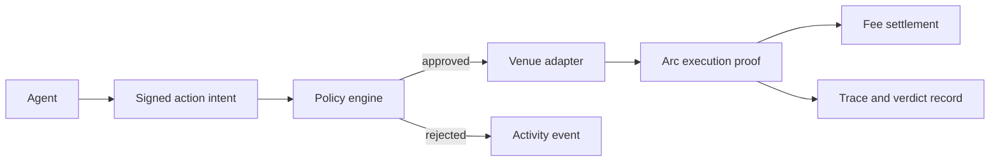

# Arc Builder Primitives

SignalArc exposes reusable building blocks for Arc applications that need autonomous agents, policy-controlled USDC execution, and public attribution.

## Primitive Inventory

| Primitive | Files | Interface |
| --- | --- | --- |
| Agent registry | `contracts/AgentRegistry.sol` | `registerAgent`, `updateAgent`, ownership and fee bps events |
| Policy vault | `contracts/PolicyVault.sol` | `depositUSDC`, `withdrawUSDC`, `createPolicy`, `subscribeAgent` |
| Attribution router | `contracts/AttributionRouter.sol` | `publishAction`, `executeAction`, execution event binding |
| Fee settlement | `contracts/FeeSettlement.sol` | `settle`, `payAgent`, platform treasury routing |
| Policy engine | `src/lib/policy.ts` | deterministic pre-execution checks |
| Action schema | `src/lib/validators.ts`, `examples/action-intent.json` | normalized intent payloads from internal or external agents |
| Adapter contract | `src/lib/adapters/types.ts` | venue-specific execution behind one interface |
| External agent gateway | `src/app/api/external-agents/route.ts` | endpoint, auth token, signature key, capability metadata |
| Receipt layer | `src/app/api/agents/[id]/receipts/route.ts` | trace, verdict, reputation, validation, and transaction references |
| Public read models | `src/app/api/platform/*` | frontend-safe data contracts that can move to a separate backend |
| Rate limit primitive | `supabase/migrations/20260515_rate_limit_function.sql` | database-backed API and provider throttling |

## Execution Contract

Every agent action is treated as an intent first, not as an execution command. The policy engine must approve the intent before an adapter can act.

## Why It Is Composable

- Contracts are narrow and can be deployed without the SignalArc UI.
- API read models isolate the frontend from database tables.
- Adapters keep venue execution replaceable.
- Receipt records let builders attach their own scoring and validation logic.
- BYO provider keys avoid shared platform API-key bottlenecks.
- The scheduler works as a Vercel cron route and can later move to queues or workers.

## Compared To Payment-Only Arc Examples

SignalArc assumes a richer coordination problem than one-off payment flows:

- A user is authorizing future actions, not paying a fixed invoice.
- An agent earns based on attributed outcomes, not access alone.
- The system must rank agents publicly and discourage low-quality recommendations.
- Execution must be explainable after the fact through trace and verdict records.
- External agents can plug in without using the SignalArc runtime.

## Builder Extension Ideas

- Replace the scoring formula in `src/lib/db/platform.ts`.
- Add ERC-8183 job lifecycle settlement around long-running agent work.
- Add custom validators that publish verdict records to the receipt rail.
- Add a new adapter for an Arc-native prediction venue.
- Split `/api/platform/*` into a separate service while keeping the frontend contract stable.
